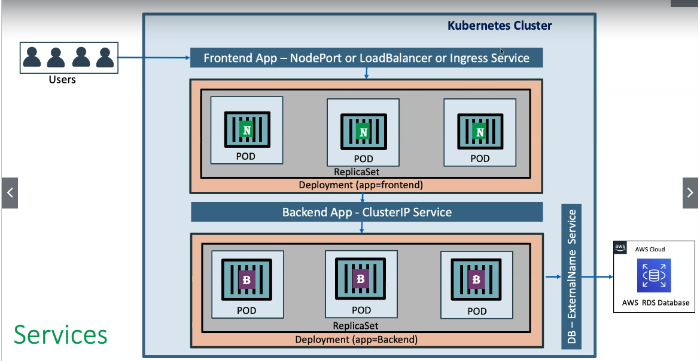

# AWS EKS Kubernetes - Masterclass | Devops Microservices

---

## K8s Concepts

| K8s Architecture              |
| ----------------------------- |
| _kubectl - Imperative (Cmds)_ |
| _Persistent Volumes_          |
| _Pods_                        |
| _Declarative with YAML_       |
| _PVC_                         |
| _Replica Sets_                |
| _Secrets_                     |
| _Load Balancers_              |
| _Deployments_                 |
| _Init Containers_             |
| _Annotations_                 |
| _Node Port Service_           |
| _Probes_                      |
| _Canary Release_              |
| _Cluster IP Service_          |
| \_Requests & Limits           |
| _HPA_                         |
| _External Name Service_       |
| _VPA_                         |
| _Namespaces_                  |
| _Ingress Service_             |
| \_Limit Range Daemon Sets     |
| _Ingress SSL_                 |
| _Resource Quota_              |
| _Fluentd for Logs_            |
| _Ingress & External DNS_      |
| _Storage Class_               |
| _Config Maps_                 |

## Links

[Markdown Lint](https://github.com/adam-p/markdown-here/wiki/Markdown-Cheatsheet)

## AWS EKS Cluster - CLIs

- AWS CLI
- kubectl
- eksctl

## kubectl

[Install on Linux](https://docs.aws.amazon.com/eks/latest/userguide/install-kubectl.html)

```bash
sudo mkdir /opt/k8s
sudo mv kubectl /opt/k8s/
sudo chmod +x /opt/k8s/kubectl
```

## eksclt

[Install on Linux](https://docs.aws.amazon.com/eks/latest/userguide/eksctl.html)

## K8s Architecture

- Service discovery and load balancing
- Storage Orchestration
- Automated rollouts and rollbacks
- Automatic bin packing
- Self-healing
- Secret and configuration management
- That thumb 

> kube-apiserver - acts as frontEnd fot the K8s control panel. It exposes the K8s API
> etcd is a key value store highly-available used as K8s backing storage for all cluster data, store all the masters and worker nodes information
> kube-scheduler - responsible for distributing containers across multiple nodes, act as watcher
> kube-controller-manager act as monitor/manager over the nodes, containers or endpoints
> node-controller - responsible for noticing and responding when nodes go down
> replication controller - responsible for maintaining the correct number of pods for every replication controller object in the system
> cloud-controller-manager - a specific cloud K8s control panel that embeds cloud-specific control logic
> kubelet is the agent that runs on every node in the cluster and they are responsible for making sure that containers are running in a Pod on a Node

### EKS Architecture

> Fargate Controller Manager is Serveless Worker Node

### K8s fundamentals


```shell
oc get pods
```

- Unable to connect to the server: x509: certificate signed by unknown authority -> runs **oc login**

- K8s does not deploy containers directly on the work nodes

- Openshift and K8s commands

```shell
kubectl get nodes -o wide
kubectl run my-first-pod --image douglasdb/vertx-native-app --generator=run-pod/v1
kubectl describe pod my-first-pod
```

- **generator=run/v1** will create a pod with a deployment template attached

## NodePort

- We ca expose an app running on a set of pods with **ClusterIP**, **NodePort** and **LoadBalancer**, LB is a special service to cloud providers, we can use NodePort to access our app in external env

- Pod my-first-pod **must** exists

```shell
kubectl expose my-first-pod --type=NodePort --port=80 --name=my-first-service
kubectl get services
kubectl logs -f my-first-pod
kubectl exec -it my-first-pod env Or ls
kubectl get service my-first-service -o yaml
```

## ReplicaSet Demo

```yaml
appVersion: apps/v1
kind: ReplicaSet
metadata:
  name: my-helloworld-rs
  labels:
    app:
```

## Kinds of Services



- ClusterIP: used for communication between apps inside K8s, e.g front communication with back end
- NodePort: used for accessing apps outside of K8s using worker nodes ports, e.g acessing front end app on browser
- LoadBalancer: Primarily for Cloud Providers to integrate with their LB service, eg AWES ELB
- Ingress: Ingress is a advanced load balancer which providers Context path based routing SSL, SSL Redirect and many more e.g AWS ALB
- externalName: To access external hosted apps in K8s cluster, e.g access AWS RDS DataBase endpoint
